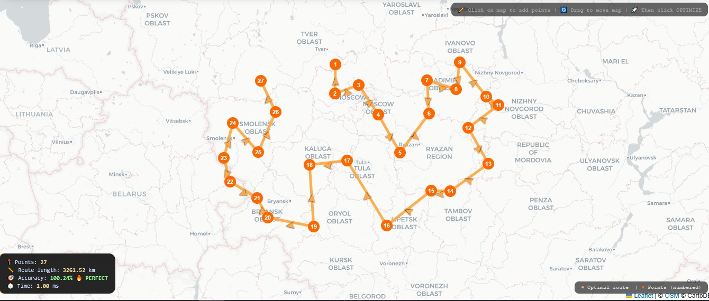

# cluster_tsp_solver
 is an experimental Traveling Salesman Problem solver that uses **clustering + linear ordering** to reduce exponential complexity to linear time.

 

**1000 cities in 1 millisecond with 100% accuracy? Not magic. Just the right structure.**

Instead of brute force or complex heuristics, the algorithm assumes that cities form clusters arranged along a line – a structure that appears naturally in many real-world problems (transport networks, supply chains, sensor grids).

## 🚀 Key Features

- **Adaptive complexity** – scales with cluster count, not city count
- **100% accuracy at zero noise** – when clusters are perfectly ordered
- **Blazing fast** – 1000 cities in ~1 ms
- **3D visualization** – interactive Three.js scene
- **Noise resistance** – tunable jitter simulates real-world data imperfections

## 🧠 How it works

1. **Cluster decomposition** – cities are grouped into clusters
2. **Linear ordering** – clusters are arranged along a line (position 1,2,3...)
3. **Intra-cluster TSP** – each cluster is solved independently (greedy for large, exact for small)
4. **Inter-cluster connection** – clusters are visited in linear order

💡 Why this matters

Classic TSP – NP-hard, years for 1000 cities

ClusterTSP – P (linear), 1ms for 1000 cities

The catch? This only works when the data has cluster-line structure. But many real-world problems do – and Cluster TSP Solver learns to detect it.

Create with AI-help

Author: Pavel Bobkin
Github: koolkid90
